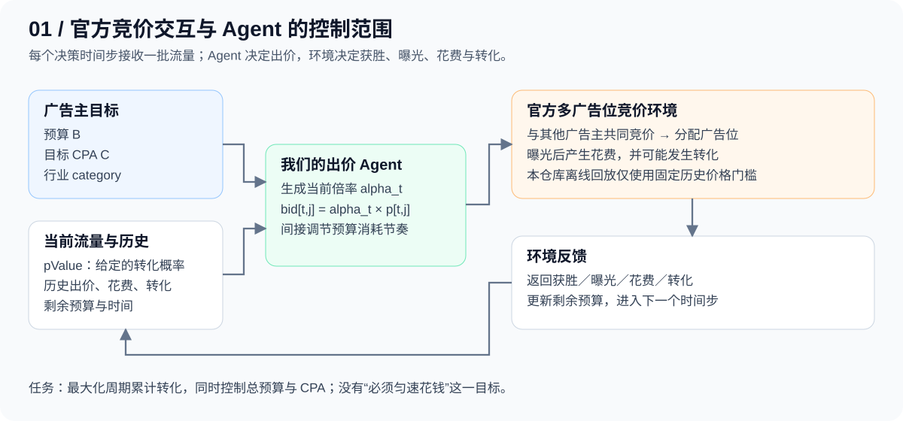
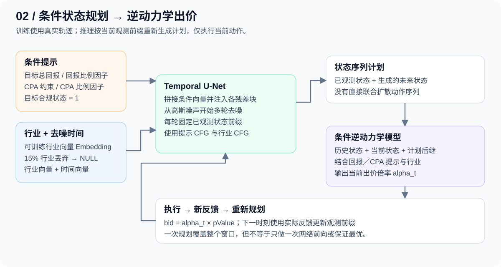
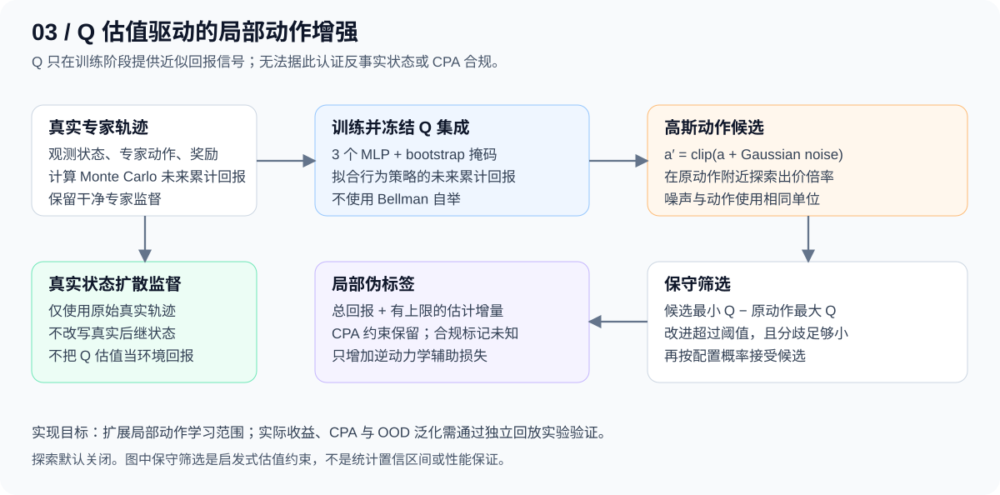

# AIGB：面向预算与 CPA 约束的生成式自动出价

这是 [NeurIPS 2024 自动出价比赛 AIGB 赛道](https://tianchi.aliyun.com/competition/entrance/532236/information)的策略训练与离线回放项目，基于[官方生成式模型 baseline](https://github.com/alimama-tech/NeurIPS_Auto_Bidding_AIGB_Track_Baseline)扩展。**比赛要解决的问题是：给广告主一笔预算和一个目标转化成本，让 Agent 持续决定每批广告机会出多少钱，在控制成本的同时获得尽可能多的转化。**

第一次阅读，可以先记住下面这张表：

| 问题 | 一句话回答 |
| --- | --- |
| 比的是什么？ | 在预算与 CPA（每次转化的平均花费）约束下自动出价；本地评分对 CPA 超标施加惩罚 |
| 一次决策做什么？ | 读取当前流量和历史反馈，输出一个出价倍率 `alpha`，每条流量的出价为 `alpha × pValue` |
| 为什么需要长期规划？ | 现在花掉的钱会减少后续机会的预算；只抢当前流量可能导致过早耗尽预算或 CPA 超标 |
| “生成式”生成什么？ | 本项目主线 DD 生成未来的**状态序列**，再由逆动力学模型将计划转为当前出价倍率 |
| baseline 有什么？ | Decision Transformer（DT）和 Decision Diffusion（DD）；DD 已有状态扩散、逆动力学和回报条件 CFG |
| 我们增加了什么？ | 行业条件、CPA／合规提示、分离的条件引导、可选的 Q 筛选动作增强，以及数据与训练推理一致性改进 |
| 已经证明提升了吗？ | 当前文档未提供真实数据上的同条件对照结果；下文介绍已实现机制，不把设计动机当作效果结论 |

建议按“[比赛机制](#1-官方竞价环境与任务) → [baseline 与新增内容](#2-从-baseline-到我们的方案) → [运行方法](#3-快速开始)”阅读；具体接口和数据校验见[技术说明](docs/decision_diffusion.md)。

[比赛机制](#1-官方竞价环境与任务) · [模型与改动对照](#2-从-baseline-到我们的方案) · [快速开始](#3-快速开始) · [验证与评估](#4-验证与评估) · [代码导航](#5-代码导航) · [资料来源](#6-资料来源)

## 1. 官方竞价环境与任务

### 1.1 一轮投放是如何进行的？

比赛将广告主的一个投放周期划分为 **48 个决策时间步**。每一步到达一批广告机会，各广告主提交出价，竞价系统分配广告位，再产生曝光、花费和可能的转化。Agent 根据本轮反馈更新下一步的策略。官方 AIGB 数据说明包含 48 个竞争广告主；具体数据规模和下载链接见[数据参考](docs/data_reference.md)。[官方 AIGB 基线说明](https://github.com/alimama-tech/NeurIPS_Auto_Bidding_AIGB_Track_Baseline#traffic-granularity-data-format)



官方日志包含多个广告位，示例中出价最高的三个广告主分别获得第 1、2、3 个广告位；获得广告位并不等于一定曝光。按示例，出价 `0.2845、0.2702、0.2154、0.1832` 时，前三者获胜，前两者曝光后分别支付 `0.2702、0.2154`。因此应区分**出价、获胜、曝光和实际花费**，不能将出价直接当作支出。[官方竞价样例](https://github.com/alimama-tech/NeurIPS_Auto_Bidding_AIGB_Track_Baseline#example-1)

后续公开的 AuctionNet 进一步描述了流量生成、广告主出价和多广告位拍卖三个模块，并支持 GSP 等拍卖机制；可进行参考。[AuctionNet 论文 §3](https://arxiv.org/html/2412.10798v1#S3)

### 1.2 Agent 能看到什么、决定什么？

| 项目 | 在本项目中的含义 |
| --- | --- |
| 广告主约束 | 初始预算 `budget`、当前剩余预算、目标 CPA `cpa`、行业 `category` |
| 当前流量 | 每条广告机会的 `pValue`：环境提供的转化概率估计，Agent 不负责训练这个预估模型 |
| 历史反馈 | 已发生的出价、竞价结果、曝光／转化结果、历史最低获胜价格 |
| 模型观测 | 将历史和当前流量聚合成 16 维状态；包括剩余时间、预算比例、历史出价／价格／转化和流量统计 |
| 模型动作 | 当前时间步共享的出价倍率 `alpha_t` |
| 接口输出 | 当前每条流量的出价数组 `bids`，其中 `bid[t,j] = alpha_t × pValue[t,j]` |
| 即时奖励 | 本步实际曝光流量产生的转化数；当前 DD 使用 `reward`，没有使用 `reward_continuous` |
| 未知信息 | 未来真实流量、未来转化和竞争对手当前／未来的出价；不能拿未来日志作为在线观测 |

状态与动作的具体构造见[轨迹生成器](bidding_train_env/dataloader/rl_data_generator.py)和[DD 出价策略](bidding_train_env/strategy/dd_bidding_strategy.py)。仓库中的“state”是 Agent 可观测信息的聚合表示，并非整个多智能体环境的完整状态。

这里的“转化”指广告主关心的目标行为，例如下单或注册；`pValue` 是该行为的预测概率。`alpha` 是出价尺度，不是概率，也不要求在 0 到 1 之间。

例如，当前三条流量的 `pValue = [0.01, 0.02, 0.05]`，若 Agent 输出 `alpha = 20`，实际提交的出价就是 `[0.2, 0.4, 1.0]`。改成 `alpha = 30` 后，出价变为 `[0.3, 0.6, 1.5]`，但最后是否获胜、曝光和付费仍由环境决定。

### 1.3 是 pacing，还是 bidding？

**准确定位是“通过动态出价倍率实现的预算／CPA 约束自动出价”，其中预算 pacing 是决策需要处理的一部分。**

| 概念 | 控制内容 | 与本项目的关系 |
| --- | --- | --- |
| Bidding | 每条流量愿意出多少钱 | 直接任务：输出倍率，再转换成每条流量的出价 |
| Budget pacing | 预算随时间以什么节奏消耗 | 间接实现：调节倍率影响获胜概率、支出和后续剩余预算 |
| 显式预算分配 | 为各时段指定预算额度或目标消耗曲线 | 当前没有独立的预算分配头或 pacing 控制器 |
| CPA 控制 | 总花费相对总转化是否过高 | 输入 CPA 条件并追踪周期结果；当前模型采用软条件而非硬约束求解器 |

若早期流量昂贵、后期流量更划算，Agent 应考虑保留预算；如果当前机会更有价值，也可以提前多花钱。**预算是资源上限，转化才是收益，匀速消耗和花完预算都不是独立的优化目标。** 降低倍率通常会降低竞争强度，但并不保证 CPA 同步降低，因为获胜流量的组成也会变化。

### 1.4 优化目标与评分

记周期总花费为 $C_{\mathrm{total}}$，总转化数为 $N$，预算为 $B$，目标 CPA 为 $C_{\mathrm{target}}$。业务目标可以表述为：

$$
\max_\pi\;\mathbb{E}[N],\qquad
C_{\mathrm{total}}\le B,\qquad
\mathrm{CPA}=\frac{C_{\mathrm{total}}}{N}\le C_{\mathrm{target}}.
$$

该表达描述优化意图；转化是随机事件，模型的 CPA 条件不保证每次投放都满足约束。零转化时需要单独处理 CPA，而不能直接除以零。

本仓库的[回放评分函数](run/run_evaluate.py)采用下式，数值实现另加极小量避免除零：

$$
\mathrm{Score}=
\begin{cases}
N, & \mathrm{CPA}\le C_{\mathrm{target}},\\
N\left(\dfrac{C_{\mathrm{target}}}{\mathrm{CPA}}\right)^2,
& \mathrm{CPA}>C_{\mathrm{target}}.
\end{cases}
$$

例如，目标 CPA 为 30，两种策略都获得 100 次转化：花费 3000 时得分为 100；花费 3750 时 CPA 为 37.5，得分降为 $100\times(30/37.5)^2=64$。这说明只追求转化数量、不考虑成本可能降低得分。

### 1.5 本地回放与完整竞价环境的区别

| 维度 | 官方竞价日志／完整环境 | 本仓库 `OfflineEnv` |
| --- | --- | --- |
| 竞争过程 | 多广告主共同出价并分配广告位 | 读取固定的历史 `leastWinningCost`，没有重新运行竞争对手 |
| 获胜／成本 | 与广告位、竞争出价和曝光有关 | `bid >= leastWinningCost` 即获胜，按该价格计费 |
| 曝光与转化 | 分开记录广告位、曝光、转化 | 简化为获胜后按概率抽样转化 |
| 超预算处理 | 取决于完整环境的执行规则 | 回放脚本随机撤销部分获胜出价，直到本步支出不超剩余预算 |
| 适用目的 | 验证完整竞争环境中的策略表现 | 检查策略接口、运行流程及近似离线表现 |

实现依据：[简化环境](bidding_train_env/environment/offline_env.py)、[回放脚本](run/run_evaluate.py)。正式评估应覆盖多个投放周期与广告主；当前 `run_test()` 只取第一个测试键并用默认广告主参数，不能据此宣称完成行业泛化验证。

## 2. 从 baseline 到我们的方案

### 2.1 先理解官方 baseline 的两条路线

训练数据是历史投放日志，记录状态 `s`、动作 `a`、奖励 `r` 和后继状态。**离线训练**是从这些已经发生的轨迹中学习策略，而不是一边训练一边请求正式竞价系统试错。这里的生成模型用于决策序列建模，不是调用语言大模型生成出价文本。

| 路线 | 如何使用历史轨迹 | 推理时如何得到出价 | 在本仓库中的定位 |
| --- | --- | --- | --- |
| Decision Transformer（DT） | 将目标剩余回报（return-to-go）、状态和动作排列成序列，用因果 Transformer 学习预测动作 | 根据目标剩余回报和已发生的历史直接预测当前倍率 | 保留的官方基线路线，本次扩展集中在 DD |
| Decision Diffusion（DD） | 对状态序列加噪，用 Temporal U-Net 学习在回报条件下去噪；另训练逆动力学模型拟合日志动作 | 固定真实历史，生成未来状态，再从状态上下文预测当前倍率 | 我们扩展的基础架构 |

DD 可以理解成两个分工：**规划器回答“接下来希望处于什么状态”，执行器回答“为接近这个状态，当前应该用多大的出价倍率”**。Temporal U-Net 沿时间轴处理状态序列；逆动力学是预测动作的 MLP，并不是拍卖模拟器。规划中生成的状态只是模型预测，执行后必须用环境的真实反馈更新历史。

```text
离线训练：流量日志 → 按广告主／周期聚合的 (状态, 倍率, 转化) 轨迹
                          ├─ 状态加噪 → U-Net 学习去噪
                          └─ 状态上下文 → 逆动力学学习历史倍率

在线决策：已观测状态 + 目标条件 → DD 规划未来状态 → 逆动力学输出 alpha
                                                        ↓
               记录真实反馈 ← 竞价／曝光／转化 ← bids = alpha × pValue
```

**状态扩散、逆动力学、固定历史前缀后重新规划，以及回报条件的 Classifier-Free Guidance（CFG，无分类器引导），都是原 DD baseline 已有的机制。** 我们在这套流程上扩展条件信息和训练方式。对照依据为[官方 DD 实现](https://github.com/alimama-tech/NeurIPS_Auto_Bidding_AIGB_Track_Baseline/blob/main/bidding_train_env/baseline/dd/DFUSER.py)与本仓库代码，不代表对所有 AIGB 论文方法的比较。

### 2.2 相比原 DD baseline，具体增加了什么？

| 维度 | 原 DD baseline | 当前方案 | 目的与边界 |
| --- | --- | --- | --- |
| 规划目标条件 | 单一轨迹总回报 | `[总回报, CPA 约束, 合规标签]`，分别缩放回报与 CPA | 明确告知模型收益目标和成本要求；属于软条件，不保证约束一定满足 |
| 行业信息 | DD 未显式编码行业 | 可训练行业 Embedding，注入 U-Net 和逆动力学；支持 NULL 行业 | 让共享模型区分行业，未知行业可回退；泛化收益待验证 |
| CFG 引导 | 回报的有条件／无条件两分支 | 无条件、仅提示、完整条件三分支；分别调节提示和行业强度 | 可分别控制业务提示和行业信息的影响，新增的是条件拆分而非 CFG 本身 |
| 动作预测 | 逆动力学只接收状态上下文 | 额外接收三维提示和行业向量 | 让规划器与执行器都利用同一组业务条件 |
| 回报标签 | `sigmoid(轨迹总回报)` | 总回报除以训练集回报尺度 | 避免较大正回报都接近 1，保留更多回报差异；仍需验证条件是否有效 |
| 状态预处理与轨迹校验 | 直接读取状态，以第 47 步切分轨迹 | 按周期／广告主分组，检查连续时间与终止标记；保存训练集标准化参数 | 支持明确终止的短轨迹，降低轨迹混合和训练推理预处理不一致的风险 |
| 去噪训练与推理对齐 | 推理时固定历史前缀，训练未按随机历史前缀构造任务 | 训练随机保留已观测前缀，只在有效未知位置计算去噪损失 | 让训练更接近“已知过去、规划未来”的实际调用方式 |
| 局部动作增强（可选） | 拟合日志中的动作 | Q 集成筛选扰动倍率，增加逆动力学辅助监督 | 尝试扩展行为动作附近的候选；默认关闭，不等于已验证的环境探索 |
| 运行与复现 | 原训练与权重保存流程 | CLI 参数、v2 checkpoint、归一化元数据、配置和扰动接受率记录、功能测试 | 便于追踪实验；旧 DD checkpoint 需要重新训练 |

其中，**行业／业务条件建模与可选动作增强是方法扩展，数据校验、标准化和训练推理对齐是配套实现改进**。若要归因某个模块的收益，应在相同数据划分和评估条件下做消融，不能将全部改动的结果都归因于行业 Embedding。

### 2.3 条件 DD：训练学什么，推理给什么？

我们希望利用生成模型学习“高回报且 CPA 合规的轨迹具有怎样的时序结构”，通过条件提示指导规划。主规划器不依赖 Bellman 自举估值，可减少对逐步价值估计的依赖；这是一种方法动机，尚不能据此断言已消除价值偏差或获得最优策略。



当前模型学习的目标可概括为：

$$
p_\theta\!\left(s_{t+1:H-1}\mid s_{0:t},\;
R_{\mathrm{target}},\;C_{\mathrm{target}},\;z_{\mathrm{compliance}},\;k_{\mathrm{industry}}\right),
\qquad H=48.
$$

这里的 $R$ 是**整个投放周期的总转化回报**。训练时用真实总回报和实际合规结果打标；推理时指定期望总回报和目标合规状态。回报／CPA 使用训练集比例因子缩放，合规标签由 `realAllCost <= CPAConstraint * realAllConversion` 计算。

执行过程为：**固定已观测前缀 → 多轮去噪生成未来状态 → 逆动力学预测当前倍率 → 执行当前出价 → 根据真实反馈重新规划**。逆动力学使用前两步、当前状态和计划后继，并接收提示与行业条件。一次采样生成整个规划窗口，不代表一次网络前向，也没有直接联合扩散状态与动作；未来动作会在后续时间步重新计算。

默认推理目标是归一化回报 `1.0` 和合规标签 `1`。输入更高回报只是外推要求，不代表环境中必然存在可达轨迹。

### 2.4 行业表征与分离的 CFG 引导

不同行业的转化概率、流量规模和时间分布可能不同。我们使用可训练的类别向量，让共享去噪网络根据行业调整生成结果：

$$
h_{\mathrm{condition}}=
\operatorname{Concat}\!\left(
E_{\mathrm{time}}(d)+E_{\mathrm{category}}(k),\;
\operatorname{MLP}(R,C,z)
\right).
$$

其中 $d$ 是**扩散去噪步**，不是投放决策时间步 $t$；条件向量注入 U-Net 各残差块。Embedding 表有 `K + 1` 项，最后一项为 NULL。训练时默认以 15% 概率随机丢弃行业，提示也独立丢弃，以学习有条件和无条件分支。

推理采用两种可调引导：

```text
epsilon = epsilon_null
        + w_prompt   * (epsilon_prompt - epsilon_null)
        + w_category * (epsilon_full   - epsilon_prompt)
```

默认 `w_prompt=1.2`、`w_category=1.0`。未知行业回退到 NULL；类别向量是任务驱动学得的表示，没有额外行业文本编码器。它能否改善稀疏行业数据下的泛化，需要分行业消融实验确认。

### 2.5 可选增强：动作扰动、Q 筛选与伪标签



探索默认关闭。启用后，先用真实轨迹训练 Q 集成，再冻结它并生成局部候选：

$$
Q_i(s_t,a_t,k,C)\approx
\frac{\sum_{u=t}^{H-1}r_u}{R_{\mathrm{scale}}},\qquad
\widetilde a_t=\operatorname{clip}(a_t+\eta),\quad
\eta\sim\mathcal N(0,\sigma^2).
$$

Q 集成包含 3 个 MLP，使用独立 bootstrap 样本掩码、共享行业嵌入，拟合的是行为轨迹的未来累计回报。它不使用 Bellman 自举，也不等同于最优 $Q^*$。候选需满足保守估计改进和集成分歧阈值：

$$
\Delta=\min_iQ_i(s_t,\widetilde a_t,k,C)
       -\max_iQ_i(s_t,a_t,k,C).
$$

被接受的候选使用有上限的 $\Delta$ 调整总回报伪标签，作为**逆动力学模型的辅助监督**；干净专家损失始终保留。CPA 约束不变，候选合规状态设为未知 `-1`，因为回报 Q 无法证明新动作仍满足 CPA。

改变出价后，原日志后继状态不再是已验证的新动作结果，所以当前增强仍是借用专家状态上下文的局部近似，**不改写状态扩散分支的真实轨迹标签**。要训练物理一致的 OOD 轨迹，需要通过环境重新获得后继状态、花费和转化。集成一致也可能存在共同外推误差；“超越专家”和“鲁棒性提升”目前是待验证目标。


## 3. 快速开始

以下命令均在仓库根目录执行。

### 3.1 安装 DD 环境

```bash
uv venv --python 3.11 .venv
uv pip install --python .venv/bin/python -r requirements-dd.txt
```

[requirements-dd.txt](requirements-dd.txt) 是本扩展验证过的独立依赖。原 `requirements.txt` 保留给旧基线，其 PyTorch 1.12 环境尚未验证本扩展。新版模型保存为 v2 checkpoint，旧 DD 权重需要重新训练。

### 3.2 准备数据

下载地址及完整字段说明见[数据参考](docs/data_reference.md)，目录建议如下：

```text
data/
├── traffic/
│   ├── period-7.csv
│   └── ...
└── trajectory/
    └── trajectory_data.csv
```

训练 CSV 至少需要状态、动作、奖励、周期／广告主／时间索引、行业、CPA 约束、真实总花费和总转化。若已有轨迹缺少成本字段，可由流量日志重新生成：

```bash
.venv/bin/python bidding_train_env/dataloader/rl_data_generator.py
```

生成文件位于 `data/traffic/training_data_rlData_folder/training_data_all-rlData.csv`，可直接作为下方 `--train-data-path`。应先按投放周期划分训练／验证／测试，再用训练 CSV 拟合归一化参数；不要把同一轨迹的片段分散到不同集合。短轨迹须有明确的 `done=1`，完整要求见[数据校验说明](docs/decision_diffusion.md#数据与运行)。

### 3.3 训练行业条件模型

```bash
.venv/bin/python main/main_decision_diffuser.py \
  --train-data-path data/trajectory/trajectory_data.csv \
  --save-path saved_model/DDtest \
  --train-epoch 20 --batch-size 64 \
  --category-dropout 0.15
```

开启 Q 扰动增强：

```bash
.venv/bin/python main/main_decision_diffuser.py \
  --train-data-path data/trajectory/trajectory_data.csv \
  --save-path saved_model/DDtest \
  --train-epoch 20 --batch-size 64 \
  --exploration --q-epochs 10 \
  --perturb-std 0.1 --perturb-probability 0.5 \
  --uncertainty-max 0.1 --improvement-min 0.01 --max-return-delta 0.1
```

`perturb-std` 的单位是原始出价倍率；倍率上限默认取训练动作最大值的 1.1 倍（至少 1），也可设置 `--action-max`。这些是初始配置示例，没有经过真实效果调优。训练产物包括 `diffuser.pt`、`training_config.json`，开启探索时额外保存 `q_ensemble.pt`；推理不需要运行 Q 网络。

## 4. 验证与评估

功能测试：

```bash
.venv/bin/python -m pytest -q tests/test_conditional_dd.py
```

运行原回放示例前，在 `bidding_train_env/strategy/__init__.py` 中将唯一生效的策略导入改为：

```python
from .dd_bidding_strategy import DdBiddingStrategy as PlayerBiddingStrategy
```

默认策略仍为 `player_bidding_strategy.py`，不会自动使用刚训练的 DD。上面的导入切换后，DD 默认从 `saved_model/DDtest/diffuser.pt` 加载权重；若训练时使用其他目录，需要通过策略构造参数 `model_path` 指向对应文件。回放数据路径在 `run/run_evaluate.py` 中默认为 `data/traffic/period-7.csv`。

随后运行：

```bash
.venv/bin/python main/main_test.py
```


功能测试用于检查实现行为，单次示例回放用于检查运行链路；两者都不能代替性能对照。建议按以下顺序组织后续实验：原 DD → 统一数据处理后的回报条件 DD → 增加 CPA／合规提示 → 增加行业条件与引导 → 开启 Q 动作增强。这里是**建议的消融设计**，当前 CLI 没有一键切换所有消融项的能力。

每组应使用相同的训练／测试周期划分、广告主预算和 CPA、多组随机种子，并同时记录 Score、转化数、花费、实际 CPA、合规率、分行业结果和推理耗时；开启增强时再记录候选接受率。正式竞赛的提交与评测规则以比赛页面为准，本仓库回放分数不应直接视为排行榜分数。

## 5. 代码导航

| 文件／目录 | 职责 |
| --- | --- |
| [DFUSER.py](bidding_train_env/baseline/dd/DFUSER.py) | Temporal U-Net、条件扩散、逆动力学、模型保存加载 |
| [dataset.py](bidding_train_env/baseline/dd/dataset.py) | 轨迹分组校验、提示标签、状态归一化 |
| [exploration.py](bidding_train_env/baseline/dd/exploration.py) | Q 集成与动作扰动伪标签 |
| [run_decision_diffuser.py](run/run_decision_diffuser.py) | Q 预训练、DD 训练和配置记录 |
| [dd_bidding_strategy.py](bidding_train_env/strategy/dd_bidding_strategy.py) | 16 维状态构造、生成倍率与逐流量出价 |
| [offline_env.py](bidding_train_env/environment/offline_env.py) | 固定历史价格门槛的简化回放环境 |
| [技术说明](docs/decision_diffusion.md) | 接口、数据约束与方法边界 |
| [数据参考](docs/data_reference.md) | 原始下载链接、字段定义和样例 |

## 6. 资料来源

- [天池 AIGB 赛道页面](https://tianchi.aliyun.com/competition/entrance/532236/information)：比赛入口及正式规则。
- [官方 baseline 仓库](https://github.com/alimama-tech/NeurIPS_Auto_Bidding_AIGB_Track_Baseline)：DT／DD 基线、数据格式和离线回放说明。
- [官方 DD 模型源码](https://github.com/alimama-tech/NeurIPS_Auto_Bidding_AIGB_Track_Baseline/blob/main/bidding_train_env/baseline/dd/DFUSER.py)与[数据处理源码](https://github.com/alimama-tech/NeurIPS_Auto_Bidding_AIGB_Track_Baseline/blob/main/bidding_train_env/baseline/dd/dataset.py)：上文 baseline 对照的实现依据。
- [本项目技术说明](docs/decision_diffusion.md)与[数据参考](docs/data_reference.md)：当前扩展的接口、数据要求及下载链接。

本文的模型行为与本地评分按仓库实现说明；竞价过程的示例来自官方日志说明。完整竞价环境、本地固定价格回放和模型生成的状态计划是三个不同层面，阅读结果时应区分。
